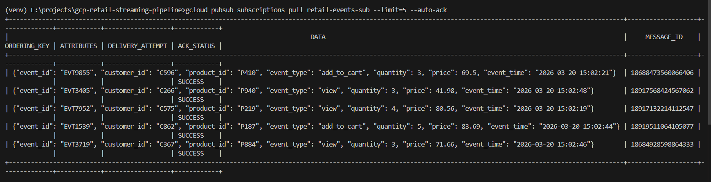

# Pub/Sub Setup

## Topic
- retail-events-topic

## Subscriptions
- retail-events-sub

## Purpose
- Topic acts as the entry point where producers send streaming data
- Subscription allows downstream systems (like Dataflow) to read messages from the topic

## Test
- Topic receives streaming events
- Subscription allows consumers to read events.

## Validation Result

- Successfully published JSON retail events from Python producer to Pub/Sub topic
- Successfully pulled events from subscription using gcloud CLI
- Confirmed end-to-end Pub/Sub flow: Producer -> Topic -> Subscription

